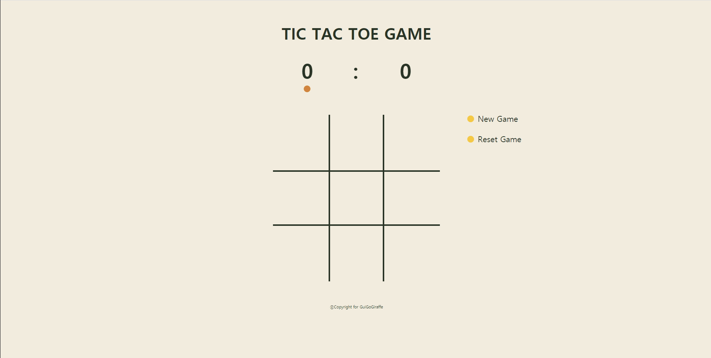

# 사전 학습 과제
사전 학습 과제는 3가지로 구성됩니다.
1. 국내외 쇼핑몰 메인화면을 HTML / CSS를 이용해 만들기.
2. Web Browser Tic-Tac-Toe 만들기
3. learnyounode Tutorial 학습하기

자세한 과제 정보는 다음 [링크](https://www.notion.so/codegiraffe/7-4-2b1192f37f5f4b14badfc7423730000d)에서 확인 하실 수 있습니다.

## Clone Web Site
국내 쇼핑몰인 [G Market](https://www.gmarket.co.kr/) 을 Clone Coding 했습니다. 작성한 코드는 CloneWebsite Directory에 존재합니다.

## Tic Tac Toe Game
Tic Tac Toe 게임을 디자인하고 개발했습니다. 아래는 만든 게임의 실행 화면입니다. 작성한 코드는 TicTacToeGame Directory에 존재합니다.

## Node Tutorial
learnyounode package를 설치하고 실행했습니다. 아래는 완료한 사진입니다. 작성한 코드는 NodeTutorial Directory에 존재합니다.

